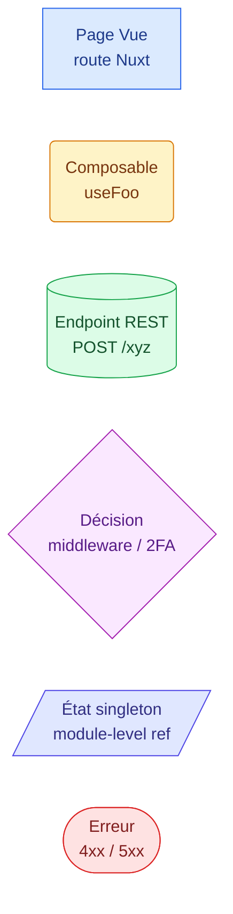
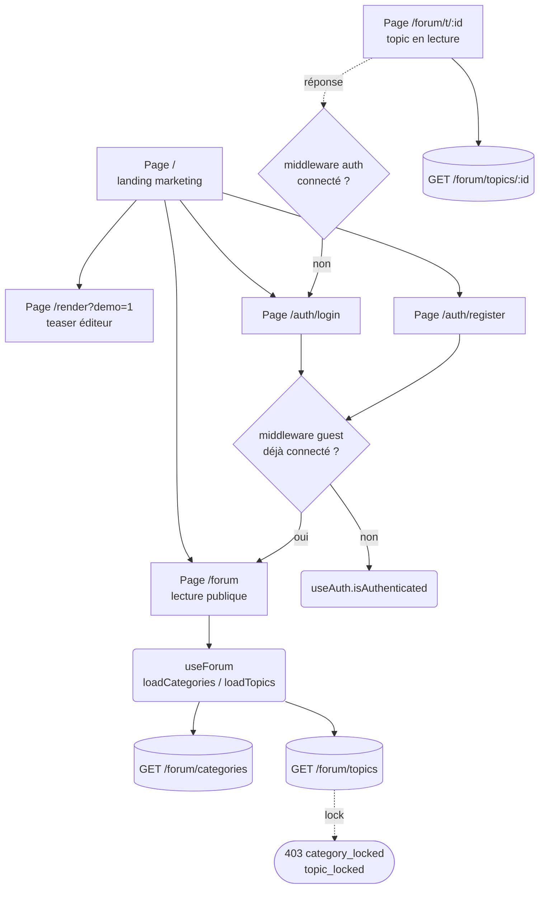
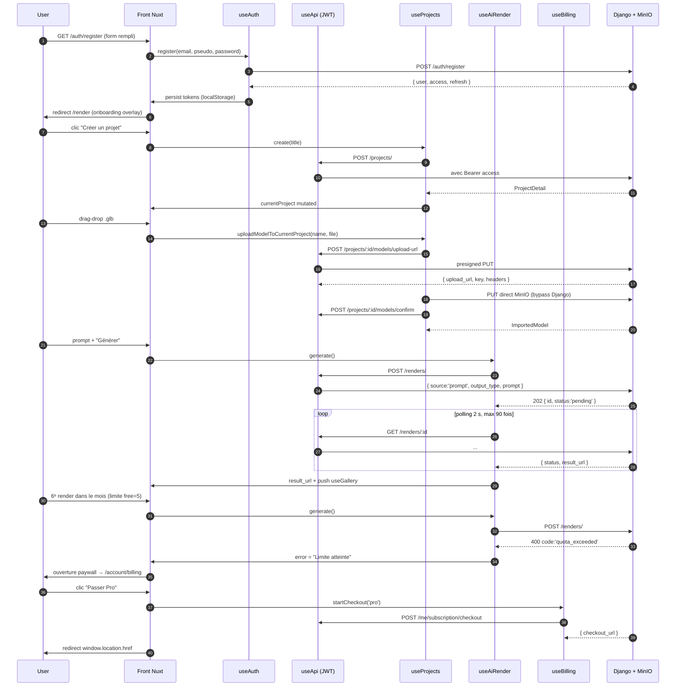
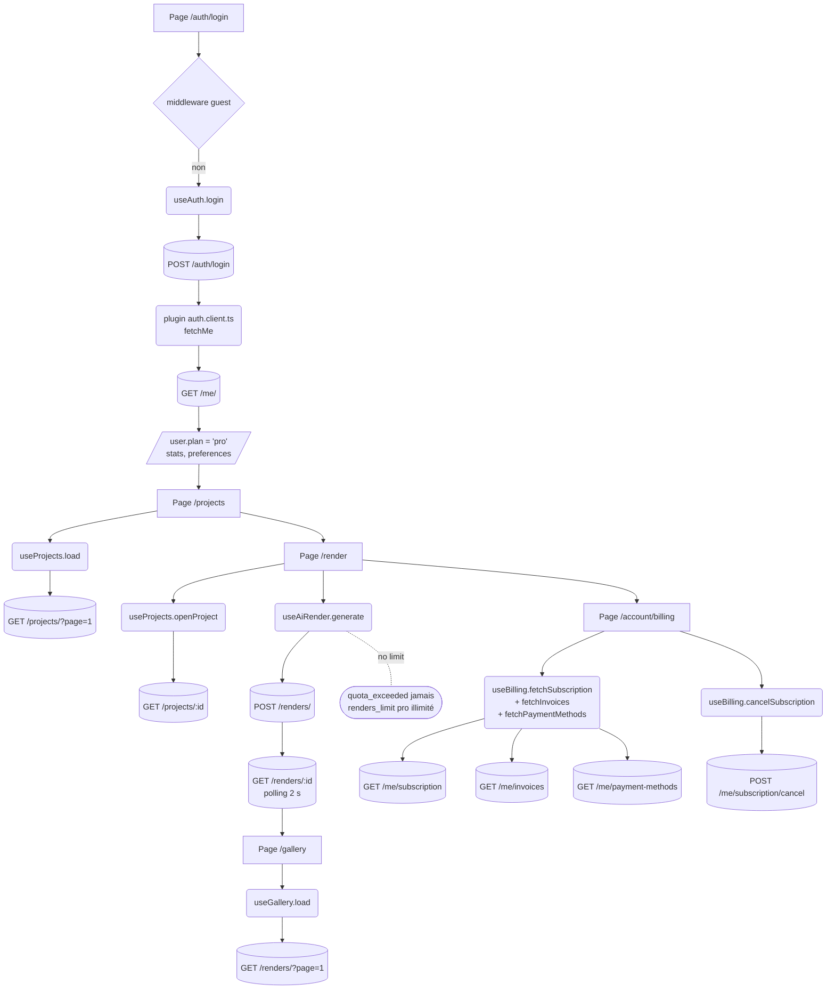
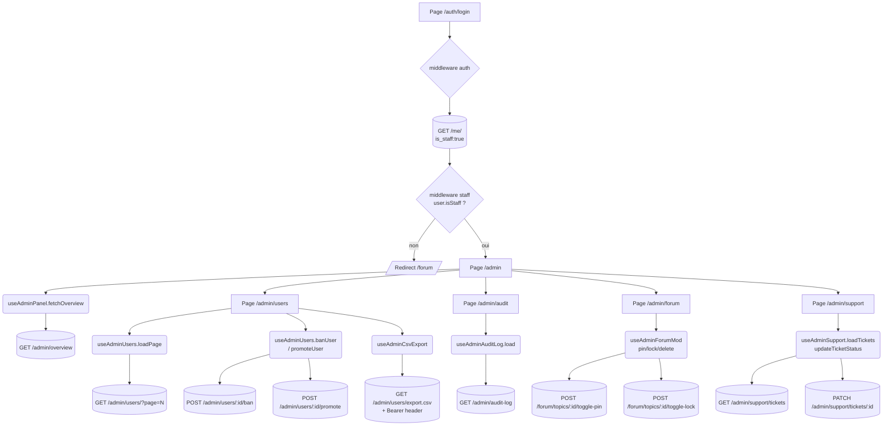
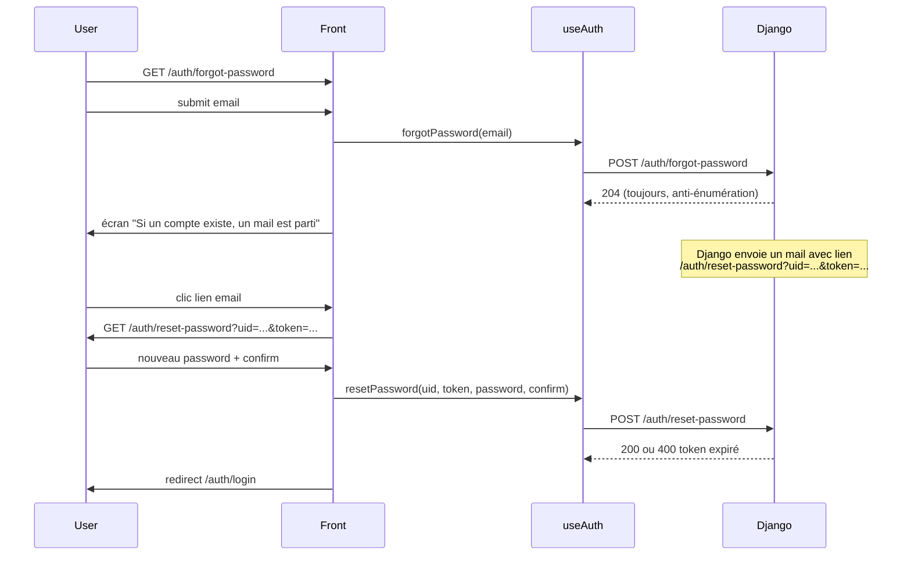
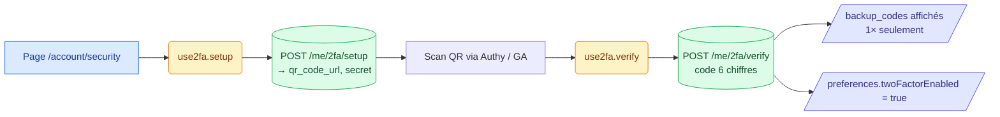
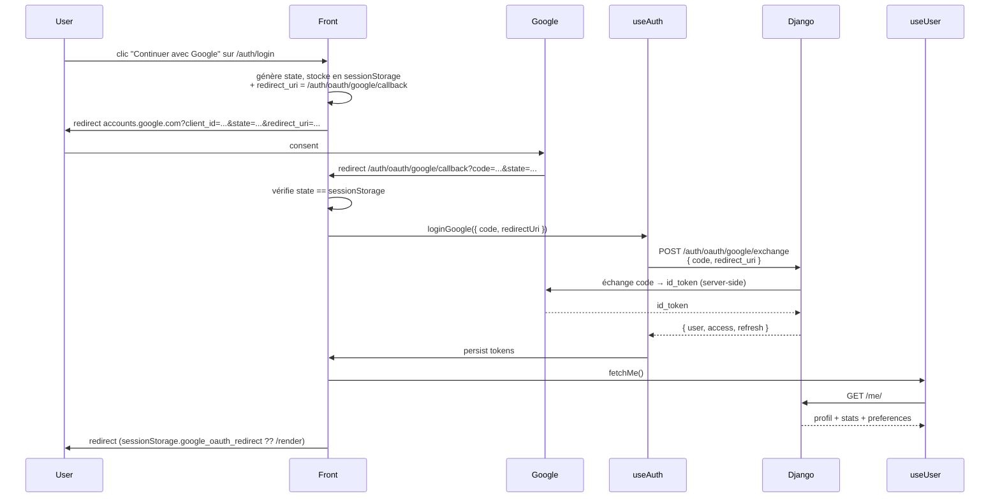
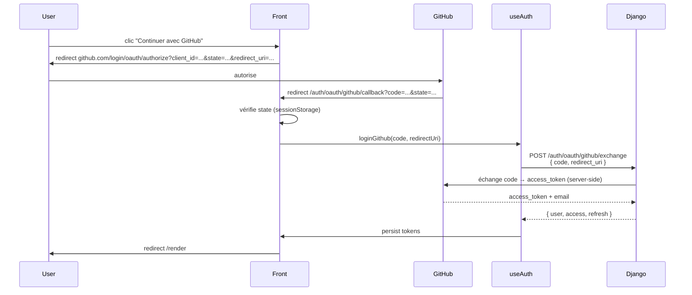

# USER_FLOWS.md

## Introduction

Ce document décrit les parcours utilisateur (user flows) de bout en bout sur VizHome (SaaS de génération de rendus 3D par IA, Nuxt 4 + Django).

Chaque parcours est décrit selon le même schéma :

1. Un diagramme `mermaid` (flowchart ou sequenceDiagram) montrant les transitions de pages, les middlewares, les composables et les endpoints sollicités.
2. Un tableau des étapes avec colonnes : `Action UI`, `Composable`, `Endpoint backend`, `État stocké`, `Erreurs possibles`.
3. Une liste de points de friction observés (UX, perf, gestion d'erreur).
4. Une liste d'optimisations possibles (préchargement, cache, Suspense, etc.).

La doc est volontairement orientée code : tous les composables sont entre `backticks` (`useAuth`, `useApi`, etc.) et tous les endpoints sont préfixés (`POST /auth/login`). Les états singletons sont stockés au niveau module (cf. `docs/ARCHITECTURE.md` : section "Composables singletons").

Comment lire :

- Les 4 premiers parcours sont les parcours principaux (anonyme, free, paid, staff).
- Les 4 parcours secondaires (reset password, 2FA, OAuth Google, OAuth GitHub) sont des branches courtes mais critiques.
- Les diagrammes sont testables sur https://mermaid.live/.

## Légende mermaid

Conventions appliquées dans tous les diagrammes du document.

| Forme / couleur | Rôle |
|---|---|
| Rectangle bleu | Page Vue (route Nuxt sous `pages/`) |
| Rectangle arrondi jaune | Composable (`composables/useXxx.ts`) |
| Cylindre vert | Endpoint backend Django (`/api/v1/...`) |
| Losange violet | Décision (middleware, 2FA, plan) |
| Parallélogramme indigo | État partagé (ref module-level) |
| Capsule rouge | Branche d'erreur / quota |

---

## 1. Parcours anonyme

Visiteur non connecté qui arrive sur `/` (landing), explore le forum en lecture seule, puis bascule vers `register` ou `login`.

### Diagramme

### Tableau des étapes

| Action UI | Composable | Endpoint backend | État stocké | Erreurs possibles |
|---|---|---|---|---|
| Arrivée sur `/` | aucun | aucun (SSR statique) | aucun | aucune |
| Clic "Essayer la démo" | `useRenderMode` | aucun (canvas Three.js local) | `currentMode` | WebGL non supporté |
| Clic "Forum" | `useForum.loadCategories`, `loadTopics` | `GET /forum/categories`, `GET /forum/topics` | `categories`, `topics`, `topicsCount` | 5xx backend, réseau |
| Lecture d'un topic | `useForum.loadTopic`, `loadReplies` | `GET /forum/topics/:id`, `GET /forum/topics/:id/replies` | `currentTopic`, `replies` | 404 topic supprimé |
| Tentative de réponse | `useApi` (intercepteur 401) | `POST /forum/topics/:id/replies` | aucun (auth requise) | 401 redirige `/auth/login` |
| Clic "Connexion" | middleware `guest.ts` | aucun | aucun | aucune (page publique) |
| Clic "Inscription" | middleware `guest.ts` | aucun | aucun | aucune (page publique) |

### Points de friction

- Le forum impose `ssr: false` sur toutes les pages `/forum/*` (cf. `CLAUDE.md` point 7), donc l'utilisateur anonyme voit d'abord un skeleton avant que `loadCategories` ne s'exécute côté client : Time-To-First-Content dégradé sur les premiers indicateurs.
- Le mode démo `/render` ne distingue pas clairement "démo" et "vrai éditeur" : un visiteur peut perdre son travail si la session se ferme sans qu'il ait créé de compte.
- Aucun gating progressif : l'utilisateur peut taper une réponse de forum en entier avant de découvrir qu'il doit se connecter.

### Optimisations possibles

- Préchargement des catégories du forum via un `useFetch` SSR-friendly côté `layouts/forum.vue` pour éviter le double fetch client.
- Cache `swr` (5 minutes) sur `GET /forum/categories` côté `useApi`, parce que la liste évolue peu.
- Détection précoce de l'auth dans le composant `ForumReplyForm` pour proposer un dialog inline `connexion / inscription` plutôt qu'une redirection brutale vers `/auth/login`.
- Persister localement le brouillon de réponse dans `localStorage` avant la redirection auth (clé `forum:draft:<topicId>`).

---

## 2. Parcours utilisateur free

Inscription, confirmation email, onboarding, création du premier projet, ajout d'un modèle 3D, premier render IA, partage, quota atteint, paywall.

### Diagramme

### Tableau des étapes

| Action UI | Composable | Endpoint backend | État stocké | Erreurs possibles |
|---|---|---|---|---|
| Submit formulaire register | `useAuth.register` | `POST /auth/register` | `tokens`, `localStorage:vizhome:auth:tokens` | 400 validation (email, pseudo unique), 5xx |
| Confirmation email (lien) | `useApi` direct | `GET /auth/confirm-email/:token` | `user.emailConfirmed` | 410 token expiré, 404 inconnu |
| Onboarding overlay `/render` | `useRenderMode`, `useThreeScene` | aucun (canvas local) | `currentMode` | WebGL absent |
| Création du projet | `useProjects.create` | `POST /projects/` | `currentProject`, `projects` (unshift) | 401 (intercepteur refresh), 400 titre vide |
| Upload modèle 3D | `useProjects.uploadModelToCurrentProject` | `POST /projects/:id/models/upload-url` puis `PUT` MinIO puis `POST /projects/:id/models/confirm` | `currentProject.importedModels` | MinIO 403 (clé/quota), 413 fichier trop gros, MTL invalide |
| Save scène Three.js | `useProjects.saveSceneState` | `PUT /projects/:id/scene` | `currentProject.scene` | 409 version conflict, payload trop gros |
| Upload thumbnail post-save | `useProjects.uploadCurrentProjectThumbnail` | `POST /projects/:id/thumbnail` | `currentProject.thumbnailUrl` | 413, format invalide |
| Génération IA (prompt) | `useAiRender.generate` | `POST /renders/` puis polling `GET /renders/:id` | `prompt`, `result`, `currentRenderId`, `promptHistory`, `useGallery.entries` | 400 `quota_exceeded`, 503 `<provider>_unavailable`, timeout 3 min |
| Partage du projet | `useProjects.createShareLink` | `POST /projects/:id/share` | (retour direct, pas persisté) | 403 plan free interdit ? 410 expiré |
| Quota atteint | `useAiRender._formatError` | renvoyé par `POST /renders/` | `error` | 400 code `quota_exceeded` |
| Paywall upgrade | `useBilling.startCheckout` | `POST /me/subscription/checkout` | redirection externe Stripe | 503 Stripe down |

### Points de friction

- Le confirm-email n'est pas bloquant côté UI : l'utilisateur peut commencer à uploader des modèles avant d'avoir cliqué le lien, et perdre l'accès si Django invalide ses tokens.
- Le pipeline upload MinIO est en trois requêtes (`upload-url`, `PUT`, `confirm`) sans rollback : si le `confirm` échoue après un `PUT` réussi, le fichier reste orphelin dans MinIO.
- Polling synchrone de 2 secondes pendant jusqu'à 3 minutes : pas de WebSocket, donc onglet en arrière-plan coûte du CPU et le rafraîchissement de page perd le `currentRenderId` (le job continue côté backend mais l'UI ne le récupère pas).
- L'erreur `quota_exceeded` est seulement affichée dans `error.value` du composable : pas de redirection auto vers la paywall, l'utilisateur doit identifier le message.
- Le passage Stripe Checkout via `window.location.href` casse l'historique : impossible de "revenir en arrière" propre vers `/render` si l'utilisateur change d'avis.

### Optimisations possibles

- Remplacer le polling par SSE ou WebSocket (`/renders/:id/stream`) côté backend pour libérer le main thread.
- Stocker `currentRenderId` dans `sessionStorage` pour pouvoir reprendre le polling après un refresh.
- Préchargement des plans : appeler `useBilling.fetchPlans()` dès qu'un seuil de 80% du quota free est atteint, pour que la paywall s'ouvre instantanément.
- Suspense Nuxt sur `/projects/index.vue` (paginé) avec `<Suspense>` autour de la grille pour permettre un skeleton plus précis.
- Cache `swr` sur `GET /projects/?page=1` (clé : `projects:list`) avec invalidation après `create` / `remove`.
- Ajouter un `<NuxtPage keepalive>` sur l'éditeur `/render` pour ne pas perdre l'état Three.js entre navigations vers `/account/billing` puis retour.

---

## 3. Parcours utilisateur paid

Login d'un compte Pro, ouverture de la liste de projets, reprise d'un projet, renders illimités, consultation galerie, factures, downgrade.

### Diagramme

### Tableau des étapes

| Action UI | Composable | Endpoint backend | État stocké | Erreurs possibles |
|---|---|---|---|---|
| Login email + password | `useAuth.login` | `POST /auth/login` | `tokens` persisté | 400 credentials invalides, 423 compte bloqué |
| Hydratation profil au boot | `useUser.fetchMe` (plugin `auth.client.ts`) | `GET /me/` | `user`, `stats`, `preferences` | 401 token expiré (refresh auto), 5xx |
| Listing projets | `useProjects.load` | `GET /projects/?page=1&page_size=12` | `projects`, `totalCount` | 401 silencieux + retry |
| Pagination infinie | `useProjects.loadMore` | `GET /projects/?page=N` | `projects` (push) | doublon si `count` désynchronisé |
| Ouvrir un projet | `useProjects.openProject` | `GET /projects/:id` | `currentProject` | 404 supprimé, 403 partagé révoqué |
| Render IA (pas de quota) | `useAiRender.generate` | `POST /renders/` puis polling | comme parcours free | 503 provider IA, timeout 3 min |
| Voir galerie | `useGallery.load` | `GET /renders/?page=1` | `entries`, `totalCount` | 401, 5xx |
| Voir factures | `useBilling.fetchInvoices` | `GET /me/invoices` | `invoices` | 503 Stripe |
| Voir abonnement | `useBilling.fetchSubscription` | `GET /me/subscription` | `subscription` | 503 Stripe |
| Annuler abonnement | `useBilling.cancelSubscription` | `POST /me/subscription/cancel` | `subscription.cancelAtPeriodEnd = true` | 503, 409 déjà annulé |
| Downgrade vers free | (pas d'endpoint direct, via cancel) | `POST /me/subscription/cancel` | idem (effet à `currentPeriodEnd`) | idem |

### Points de friction

- La page `/account/billing` lance trois fetchs en parallèle (`fetchSubscription`, `fetchInvoices`, `fetchPaymentMethods`) mais affiche tout via le même `isLoading` global : si un seul échoue, l'UI montre l'erreur globale alors que les deux autres sont OK (cf. `loadErrors` array dans le `.vue`).
- L'annulation est un soft-cancel à `currentPeriodEnd` mais le badge "Pro" reste affiché jusqu'à la fin de période : ambigu pour l'utilisateur, source de tickets support.
- Retour de Stripe Checkout via redirection HTTP : le query `?session=success` n'est intercepté que côté UI, donc si l'utilisateur ferme avant le retour, la confirmation arrive uniquement via webhook (delta visible).
- `useProjects.load` recharge à chaque navigation vers `/projects` : pas de cache, donc un aller-retour `/projects` -> `/render` -> `/projects` refait l'appel.

### Optimisations possibles

- `useBilling.fetchAll()` qui fait `Promise.allSettled` et expose un `loadErrors` typé par endpoint (le pattern est déjà ébauché dans `billing.vue` mais devrait remonter dans le composable).
- Mettre `subscription.plan` en dérivé de `useUser.user.plan` plutôt qu'en double fetch : `useUser` est déjà hydraté au boot.
- Cache `keep-alive` sur `/projects` au niveau de `<NuxtPage>` pour préserver la grille pendant les allers-retours.
- Préchargement de la galerie : sur hover du lien "Galerie" dans la sidebar, déclencher `useGallery.load()` en avance.
- Webhook Stripe -> SSE vers le front pour mettre à jour `subscription.status` en temps réel sans devoir recharger.

---

## 4. Parcours staff (admin panel)

Login d'un staff, navigation dans le panel admin, drill-down sur un user, action de modération, audit log, modération forum, tickets support.

### Diagramme

### Tableau des étapes

| Action UI | Composable | Endpoint backend | État stocké | Erreurs possibles |
|---|---|---|---|---|
| Login staff | `useAuth.login`, `useUser.fetchMe` | `POST /auth/login`, `GET /me/` | `user.isStaff = true` | 401, 403 si `is_active = false` |
| Accès `/admin/*` | middleware `staff.ts` | aucun | aucun (lecture `user.isStaff`) | redirect `/forum` si non-staff |
| Overview tableau de bord | `useAdminPanel.fetchOverview` | `GET /admin/overview` | `overview`, `alerts` | 403, 5xx |
| Liste paginée users | `useAdminUsers.loadPage` | `GET /admin/users/?page=N&search=...` | `users`, `totalCount` | 400 filtre invalide |
| Ban / unban user | `useAdminUsers.banUser` | `POST /admin/users/:id/ban` | mise à jour optimiste de la ligne | 403 staff ne peut pas se ban soi-même |
| Promote staff | `useAdminUsers.promoteUser` | `POST /admin/users/:id/promote` | idem | 403 dernière protection |
| Export CSV | `useAdminCsvExport` | `GET /admin/users/export.csv` (avec Bearer) | blob téléchargé via `<a download>` | 401 si token périmé pendant le download |
| Audit log paginé | `useAdminAuditLog.load` | `GET /admin/audit-log/?action=...&actor=...` | `entries`, `filters` | 400 filtre, 403 |
| Modération forum (pin/lock) | `useAdminForumMod.togglePin` (réutilise `useForum`) | `POST /forum/topics/:id/toggle-pin`, `POST /forum/topics/:id/toggle-lock` | mise à jour optimiste de `currentTopic.is_pinned` | 403 si forum ban |
| Supprimer un topic | `useForum.deleteTopic` | `DELETE /forum/topics/:id` | retrait de `topics` array | 404 déjà supprimé |
| Lister tickets support | `useAdminSupport.loadTickets` | `GET /admin/support/tickets/?status=...` | `tickets`, `ticketsCount` | 403 |
| Changer statut ticket | `useAdminSupport.updateTicketStatus` | `PATCH /admin/support/tickets/:id` | mise à jour `currentTicket.status` | 409 transition invalide |

### Points de friction

- `middleware: ['auth', 'staff']` lit `user.value.isStaff`, mais si `useUser.fetchMe()` n'a pas encore été appelé (cas du deep-link à froid), le check renvoie `false` et redirige vers `/forum`. Le plugin `auth.client.ts` mitige ça mais reste un race condition possible si le deep-link arrive avant l'hydratation.
- L'export CSV via blob nécessite de passer le header `Authorization: Bearer ...` manuellement, donc on ne peut pas utiliser un simple `<a href>` : ça impose `fetch + URL.createObjectURL`, et un download interrompu n'a pas de reprise.
- Toutes les pages `/admin/*` sont en `ssr: false` : la première arrivée affiche un skeleton, gênant pour un staff qui veut un dashboard "instantané".
- Les actions de modération (ban / promote / lock) n'ont pas de confirmation à deux étapes : un clic suffit. Risque de fausse manip.
- L'audit log paginé n'a pas de filtre par plage de dates dans le composable (vu sur `useAdminAuditLog.load`), donc remonter un incident d'il y a 3 jours = paginer manuellement.

### Optimisations possibles

- Pré-hydratation côté plugin : `auth.client.ts` doit `await fetchMe()` avant que le router ne résolve la navigation initiale (`router.isReady()` + Suspense).
- Cache court (30 s) sur `GET /admin/overview` parce que les staff rafraîchissent souvent.
- Confirmation `<AlertDialog>` systématique sur ban / promote / delete (le pattern existe déjà dans `pages/gallery/index.vue`).
- WebSocket `/admin/events` pour pousser les nouveaux tickets / signalements forum sans poll.
- Filtre `date_from` / `date_to` dans `useAdminAuditLog` (le backend l'accepte déjà sur `/admin/audit-log/`).
- Export CSV en background avec progress bar et `Notification` API quand prêt.

---

## Parcours secondaires

### 5. Reset password

Flow `forgot-password` -> email -> `reset-password` -> retour `login`.

| Action UI | Composable | Endpoint backend | État stocké | Erreurs possibles |
|---|---|---|---|---|
| Submit email | `useAuth.forgotPassword` | `POST /auth/forgot-password` | aucun | aucune visible (204 systématique) |
| Clic lien email | aucun | aucun (route Nuxt) | `route.query.uid`, `route.query.token` | lien expiré (vérif au submit) |
| Submit nouveau password | `useAuth.resetPassword` | `POST /auth/reset-password` | aucun | 400 token expiré, 400 password trop faible |

Friction : pas d'auto-login après reset, l'utilisateur doit se reconnecter manuellement. Optim : enchaîner un `login` automatique si succès.

### 6. Setup 2FA TOTP

Activation du second facteur depuis les préférences.

| Action UI | Composable | Endpoint backend | État stocké | Erreurs possibles |
|---|---|---|---|---|
| Clic "Activer 2FA" | `use2fa.setup` | `POST /me/2fa/setup` | `qrCodeUrl`, `secret` (éphémères) | 409 déjà activé |
| Scan + saisie code | `use2fa.verify` | `POST /me/2fa/verify` | `preferences.twoFactorEnabled = true`, `backupCodes` | 400 code invalide, 410 secret expiré |
| Affichage backup codes | aucun | aucun | affichage one-shot, jamais re-fetchable | aucune (sauf perte = recovery flow séparé) |

Friction : les `backup_codes` ne sont affichés qu'une fois, sans confirmation utilisateur ("j'ai sauvegardé") avant fermeture. Optim : checkbox bloquante + bouton "Télécharger en .txt".

### 7. OAuth Google

Flow `code` (authorization code) avec round-trip vers `accounts.google.com`.

| Action UI | Composable | Endpoint backend | État stocké | Erreurs possibles |
|---|---|---|---|---|
| Clic bouton Google | aucun (handler `handleGoogleLogin`) | aucun (OAuth providé Google) | `sessionStorage:google_oauth_state`, `google_oauth_redirect` | clientId manquant -> bouton disabled |
| Retour callback `?code` | `useAuth.loginGoogle({ code, redirectUri })` | `POST /auth/oauth/google/exchange` | `tokens` | `error=access_denied` (refus), state mismatch (CSRF), 400 code invalide |
| Hydratation profil | `useUser.fetchMe` | `GET /me/` | `user`, `stats`, `preferences` | 401 (cas absurde post-login) |

Le composable accepte aussi le flow legacy `id_token` (One Tap SDK) en alternative : `loginGoogle({ idToken })` -> même endpoint, body `{ id_token }`.

Friction : la valeur `expectedState` est lue depuis `sessionStorage`, qui ne survit pas à un nouvel onglet : si Google ouvre le consent dans un autre onglet, le state est perdu. Optim : passer par un cookie SameSite=Lax éphémère côté backend pour persister entre fenêtres.

### 8. OAuth GitHub

Même structure que Google, sans option `id_token`.

| Action UI | Composable | Endpoint backend | État stocké | Erreurs possibles |
|---|---|---|---|---|
| Clic bouton GitHub | handler `handleGithubLogin` | aucun | `sessionStorage:github_oauth_state` | clientId manquant |
| Retour callback `?code` | `useAuth.loginGithub` | `POST /auth/oauth/github/exchange` | `tokens` | `error=access_denied`, state mismatch, 400 |
| Hydratation profil | `useUser.fetchMe` | `GET /me/` | `user`, `stats`, `preferences` | 401 |

Friction : GitHub ne fournit pas systématiquement l'email (si l'utilisateur l'a mis privé), donc le backend doit fallback sur `/user/emails` côté API GitHub. Si tous les emails sont privés ou non vérifiés, l'exchange renvoie une 400 et l'UI affiche "Email GitHub indisponible". Optim : message d'erreur explicite côté front avec lien d'aide "Comment rendre votre email public chez GitHub".

---

## Annexe : pattern transverse `useApi`

Toutes les requêtes authentifiées des parcours ci-dessus passent par `useApi` qui :

1. Injecte automatiquement `Authorization: Bearer <access>` depuis `useAuth.tokens`.
2. Sur 401, appelle `useAuth.refreshAccessToken()` puis rejoue la requête une seule fois.
3. Sur échec du refresh, appelle `useAuth.logout()` puis redirige vers `/auth/login`.

Cette couche est invisible des composables métier (`useProjects`, `useAiRender`, etc.), ce qui rend les parcours résilients aux access tokens courts (15 minutes). La conséquence est que les composables NE doivent PAS catcher manuellement les 401 : laisser remonter à `useApi`.
